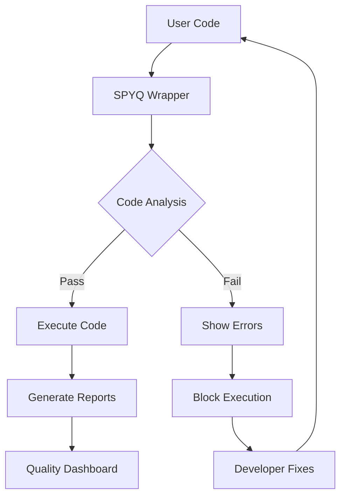
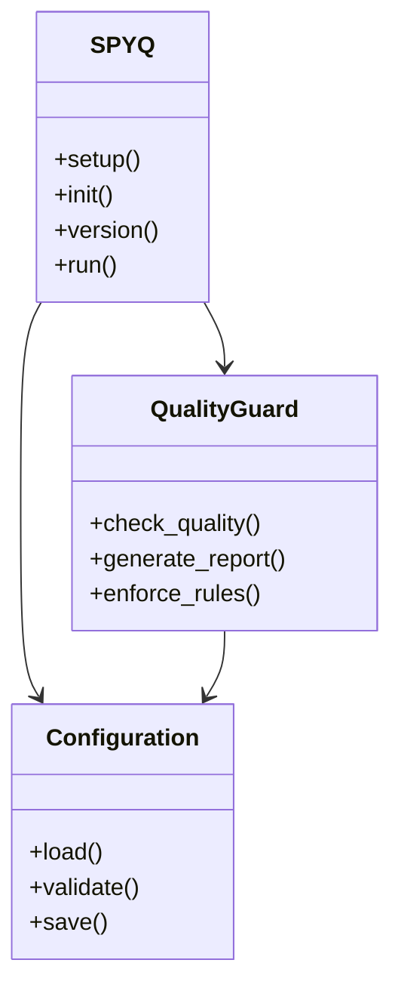
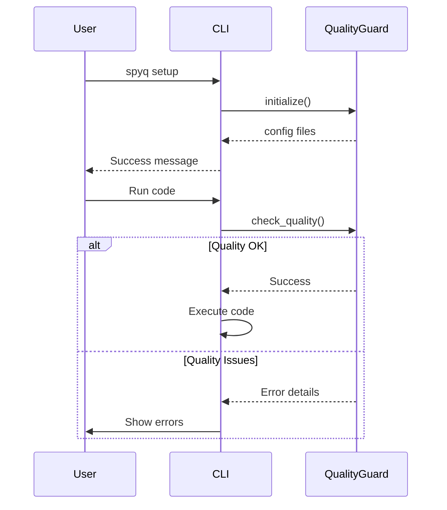

# SPYQ Architecture

## System Overview



## Component Diagram



## Data Flow

```
+----------------+     +----------------+     +----------------+
|                |     |                |     |                |
|   User Code   |---->|  SPYQ Wrapper  |---->|  Code Analysis |
|                |     |                |     |                |
+----------------+     +----------------+     +--------+-------+
                                                      |
                                                      v
+----------------+     +----------------+     +--------+-------+
|                |     |                |     |                |
|  Block Execution <-----+  Fail Check   <-----+                |
|                |     |                |     |                |
+--------+-------+     +----------------+     +----------------+
         ^
         |
+--------+-------+
|                |
|  Show Errors   |
|                |
+----------------+
```

## Sequence Diagram



## Directory Structure

```
spyq/
├── src/
│   └── spyq/
│       ├── __init__.py
│       ├── cli.py
│       ├── setup_quality_guard.py
│       └── commands/
│           └── init.py
├── tests/
├── docs/
│   ├── ARCHITECTURE.md
│   ├── API.md
│   └── CONTRIBUTING.md
├── .spyq/
│   ├── config.json
│   ├── .eslintrc.advanced.js
│   ├── .prettierrc
│   └── sonar-project.properties
├── pyproject.toml
└── README.md
```

## Quality Gates

```
+---------------------+----------------+------------------+
|      Quality        |     Pass       |      Fail        |
+=====================+================+==================+
| Code Style         | Formatted      | Not Formatted    |
+---------------------+----------------+------------------+
| Test Coverage      | ≥ 80%          | < 80%            |
+---------------------+----------------+------------------+
| Complexity         | Cyclomatic < 10| Cyclomatic ≥ 10  |
+---------------------+----------------+------------------+
| Documentation      | Complete       | Incomplete       |
+---------------------+----------------+------------------+
| Security           | No Issues      | Issues Found     |
+---------------------+----------------+------------------+
```
