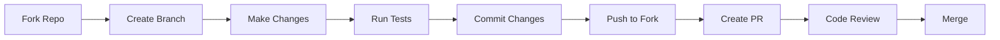

# Contributing to SPYQ

Thank you for considering contributing to SPYQ! We welcome all contributions, including bug reports, feature requests, documentation improvements, and code contributions.

## Getting Started

### Prerequisites

- Python 3.7+
- Poetry (for dependency management)
- Node.js 14+ (for JavaScript/TypeScript linting)
- Docker (for testing in isolated environments)

### Setup Development Environment

1. **Fork and clone** the repository:
   ```bash
   git clone https://github.com/wronai/spyq.git
   cd spyq
   ```

2. **Install dependencies** with Poetry:
   ```bash
   poetry install
   ```

3. **Install pre-commit hooks**:
   ```bash
   poetry run pre-commit install
   ```

## Development Workflow



### Branch Naming

Use the following format for branch names:

```
<type>/<description>-<issue-number>
```

Example: `feat/add-logging-42`

### Commit Messages

Follow the [Conventional Commits](https://www.conventionalcommits.org/) specification:

```
<type>[optional scope]: <description>

[optional body]

[optional footer(s)]
```

Types:
- `feat`: New feature
- `fix`: Bug fix
- `docs`: Documentation changes
- `style`: Code style changes
- `refactor`: Code refactoring
- `test`: Adding tests
- `chore`: Maintenance tasks

## Testing

### Running Tests

```bash
# Run all tests
poetry run pytest

# Run with coverage
poetry run pytest --cov=spyq --cov-report=term-missing

# Run specific test file
poetry run pytest tests/test_file.py
```

### Linting and Formatting

```bash
# Run all linters
poetry run black .
poetry run isort .
poetry run flake8
poetry run mypy .

# Auto-fix what you can
poetry run black .
poetry run isort .
```

## Pull Request Process

1. Ensure all tests pass
2. Update documentation if needed
3. Add/update tests for new features
4. Ensure code meets style guidelines
5. Update CHANGELOG.md
6. Submit PR with a clear description

## Code Style

### Python
- Follow PEP 8
- Use type hints
- Keep functions small and focused
- Write docstrings for all public APIs

### JavaScript/TypeScript
- Follow StandardJS
- Use ES6+ features
- Add JSDoc comments

## Release Process

1. Update version in `spyq/__init__.py`
2. Update CHANGELOG.md
3. Create a release tag
4. Push tag to trigger CI/CD

## Need Help?

- Open an issue
- Join our [Discord/Slack]
- Check the documentation

## Code of Conduct

Please note that this project is released with a [Contributor Code of Conduct](CODE_OF_CONDUCT.md). By participating in this project you agree to abide by its terms.
